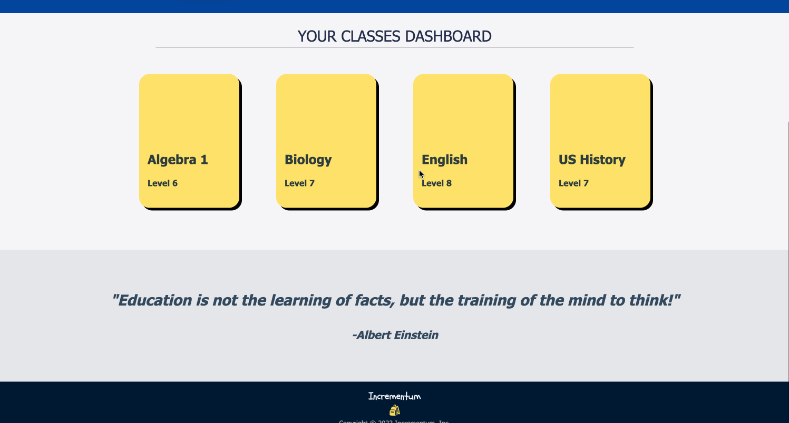

# Incrementum

This application is for managing online learning. It helps teachers and students to keep track of their courses, homework assignments and grades.

Live site: https://incrementum-learning.netlify.app/login
- - - -
## App Features

### Teacher Portal:
* Teachers have the ability to create new courses and lessons, as demonstrated below:




* Teachers can add/edit lessons and assignments:


* Teachers can view student grades, update a student's assignment status and score, and provide feedback:


### Student Portal:
* Students can enroll in available courses, view lessons, submit assignments, and track their own grades and progress for each course:


- - - -
## Technologies Used
Java, Spring Boot, PostgreSQL, Vue.js, JavaScript, Maven, JUnit, Cypress, Mocha

- - - -
## Installation
You must have JDK 11 or higher installed on your machine in order for the source code to compile.

From the project root, execute the following commands to create a local database and run the server-side app:
```
cd capstone/java/database
sh create.sh

cd ..
npm install
npm run dev
```

From the project root, execute the following commands to run the client-side app:
```
cd capstone/vue
npm install
npm run serve
```

- - - -
## Roadmap
This project was built using Agile methodologies to meet MVP requirements within a 10-day timeline. With more development time, our team would like to implement the following additional features:
* A third user account type for school administrators with theme customization options
* A fourth user account type for parents to view their child's course progress and communicate with teachers 
* Ability to upload files as a homework submission type
* Ability to create and take quizzes as another "assignment" type


- - - - 
## Authors and acknowledgment
Incrementum was built in collaboration with fellow Tech Elevator alumnae Mark Darby, Phillips Preston, and William Kendig.
